# medical-appointments-system
Артефакты системного анализа для личного кабинета пациента медицинской клиники: запись на чекап и просмотр результатов анализов.

Для функции "Запись на чекап и отслеживание статуса прохождения":

1)Составлена AS-IS диаграмма процесса в нотации BPMN для отражения текущего процесса записи пациента на прием к врачу.
.png)

2)На основе модели AS-IS составлена диаграмма TO-BE в нотации BPMN для автоматизации процесса записи на приём к врачу в приложении, чтобы пациент, зайдя в приложение медицинской клиники, мог самостоятельно записаться на приём.
.png)

3)Составлена AS-IS диаграмма состояний в нотации UML State Machine
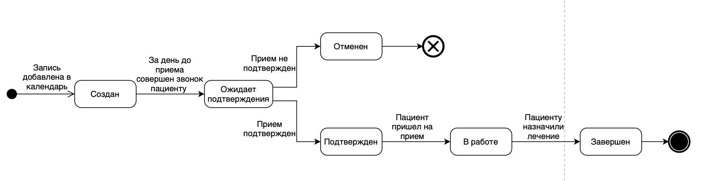

4)В рамках Agile-меодологии оставлена User Story Map и выделен MVP
.png)
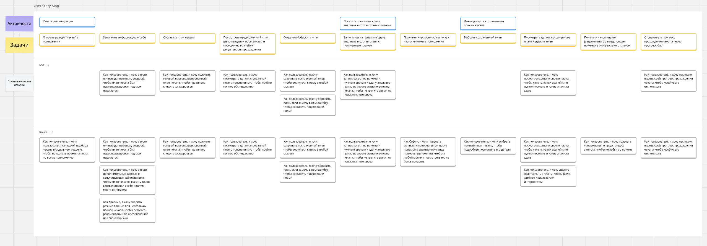

5)https://miro.com/app/board/uXjVG516VQo=/?share_link_id=801322285326 (ссылка на доску в Miro)

6)Cоздана раскадровка (Storyboard) — последовательность эскизов интерфейса мобильного приложения для функции записи на чекап в Figma
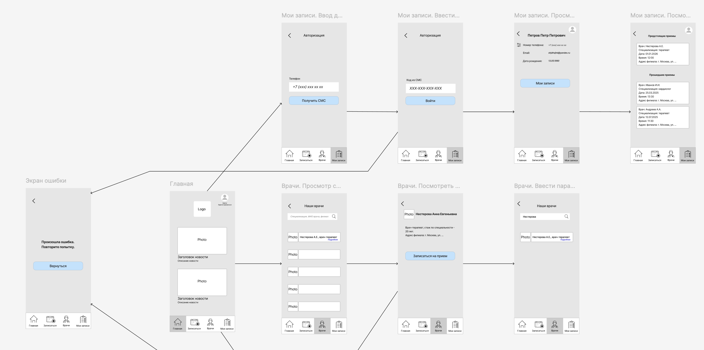
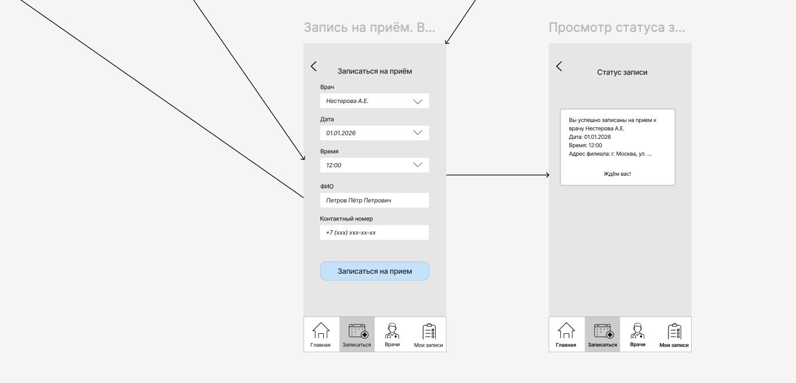
https://www.figma.com/design/9pmjOENQ1OtbcRi8XxFoCh/%D0%A0%D0%B0%D1%81%D0%BA%D0%B0%D0%B4%D1%80%D0%BE%D0%B2%D0%BA%D0%B0-%D0%B7%D0%B0%D0%BF%D0%B8%D1%81%D1%8C-%D0%BD%D0%B0-%D1%87%D0%B5%D0%BA%D0%B0%D0%BF?node-id=0-1&t=yXJQFMctqVcRtPBr-1 (ссылка на Figma)

Для функции "Просмотр результатов анализов":

1)В рамках Agile-меодологии оставлена User Story Map и выделен MVP
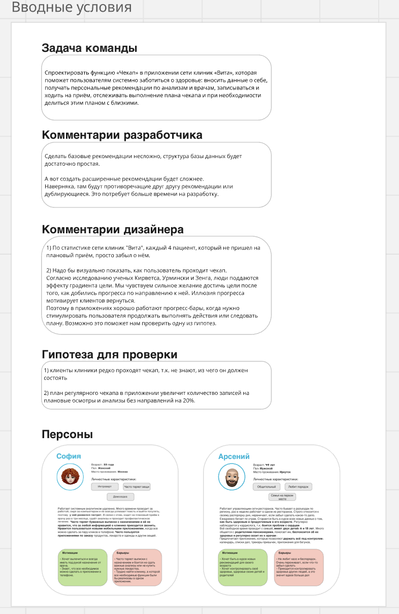
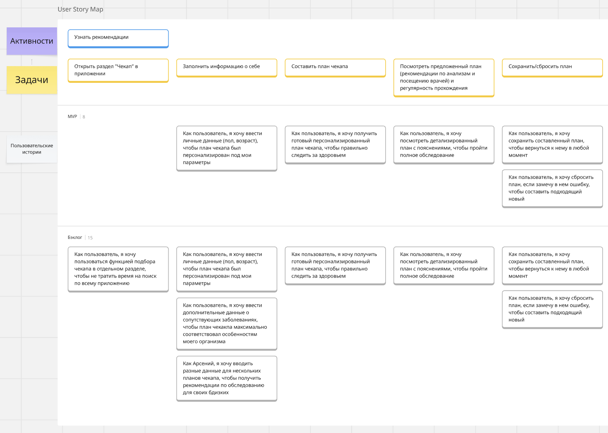
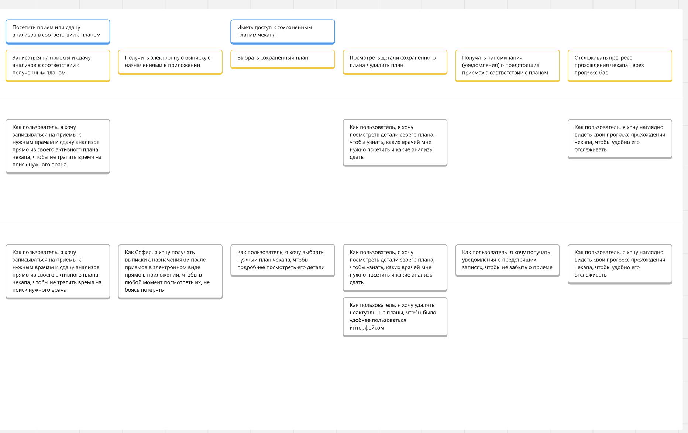

https://miro.com/app/board/uXjVG5Vwohs=/?share_link_id=678630179129 (ссылка на доску Miro)

2)Составлена DFD-диаграмма потоков данных на контекстном и логическом уровне
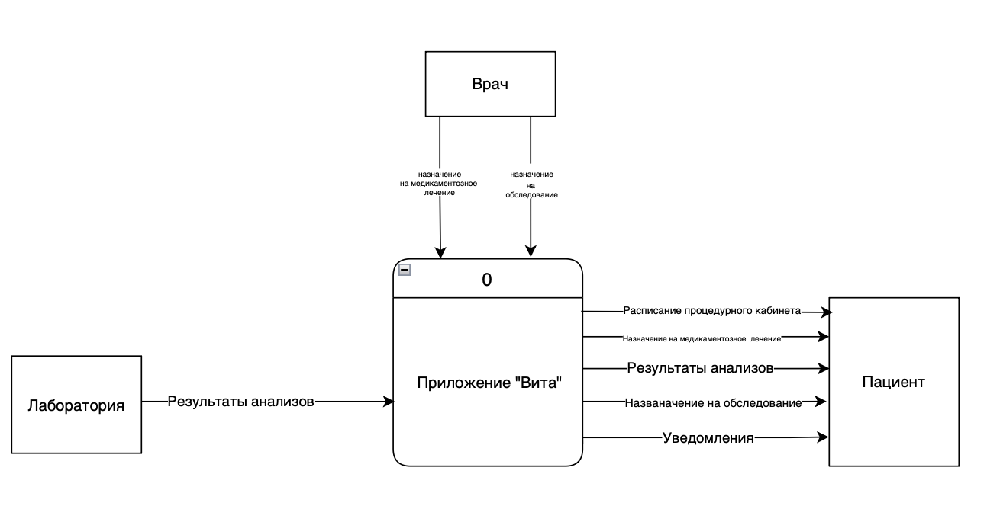
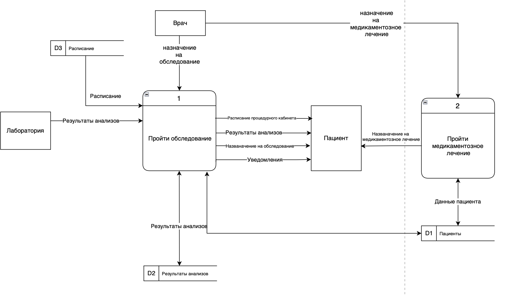

3)Cоздана раскадровка (Storyboard) — последовательность эскизов интерфейса мобильного приложения для функции просмотра результатов анализов в Figma
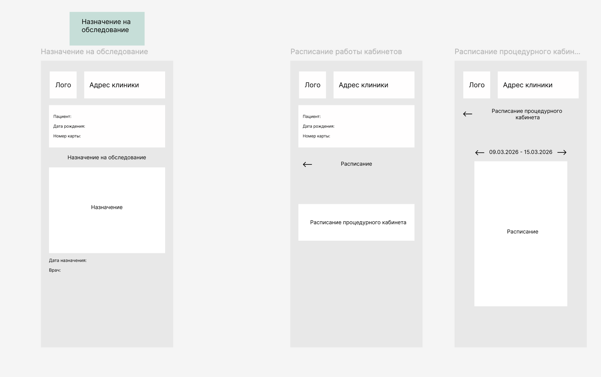
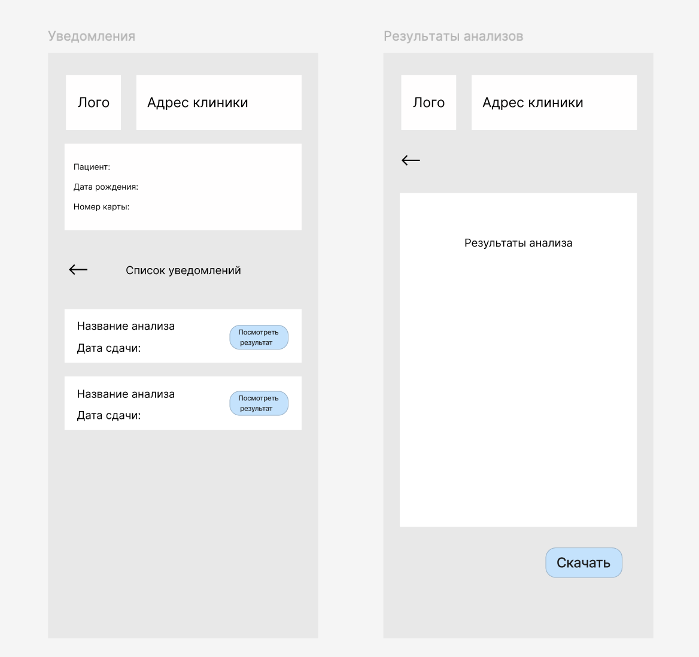
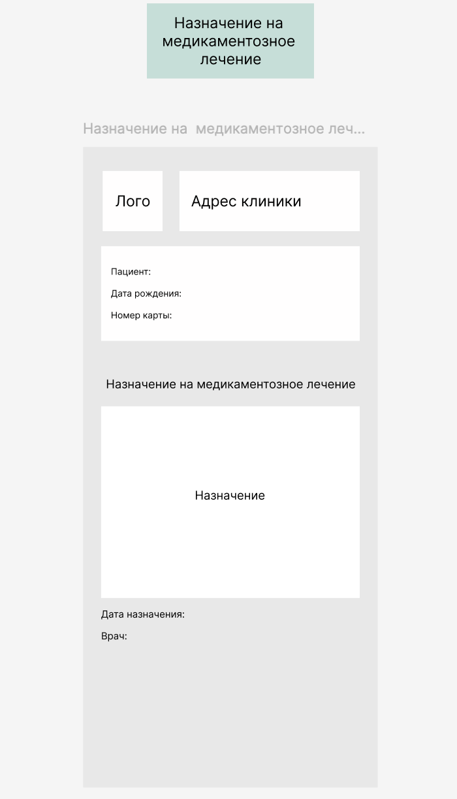

https://www.figma.com/design/RbHI3ETQ5QOcuW2fxyrIKA/%D0%9F%D1%80%D0%BE%D1%82%D0%BE%D1%82%D0%B8%D0%BF%D1%8B-%D0%BF%D1%80%D0%B8%D0%BB%D0%BE%D0%B6%D0%B5%D0%BD%D0%B8%D1%8F-%D0%92%D0%B8%D1%82%D0%B0--%D0%A0%D0%B5%D1%86%D0%B5%D0%BF%D1%82%D1%8B-%D0%92%D0%B8%D1%82%D0%B0-?node-id=0-1&t=ubX7pwn3iMDPtNkn-1 (ссылка на Figma)

